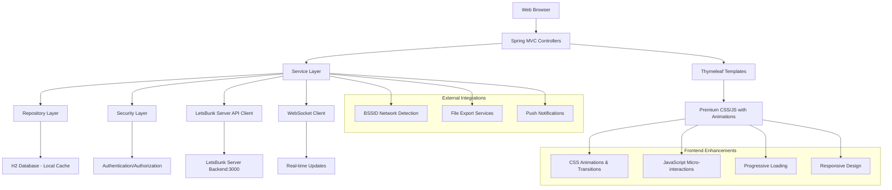

# Design Document

## Overview

The Enhanced LetsBunk Admin Panel will be built as a Spring Boot web application with premium UI/UX design and full server integration. The system will connect to the existing LetsBunk server backend while providing a modern, animated interface with smooth transitions, glassmorphism effects, and micro-interactions that create a delightful user experience.

The design follows a layered architecture pattern with clear separation of concerns, utilizing Spring MVC for web layer, REST API integration for server communication, Spring Data JPA for local caching, and Thymeleaf with advanced CSS/JavaScript for premium frontend experience.

## Architecture

### System Architecture



### Technology Stack

- **Backend Framework**: Spring Boot 3.2.0
- **Web Framework**: Spring MVC
- **Template Engine**: Thymeleaf
- **Database**: H2 (Local caching) + LetsBunk Server Backend
- **ORM**: Spring Data JPA with Hibernate
- **Security**: Spring Security + JWT Integration
- **API Integration**: RestTemplate/WebClient for server communication
- **Real-time**: WebSocket/SockJS for live updates
- **Frontend**: HTML5, CSS3 (with animations), JavaScript (ES6+)
- **UI Framework**: Custom CSS with Glassmorphism, Animations, Transitions
- **Build Tool**: Maven
- **Java Version**: 17
- **Server Integration**: LetsBunk Backend API (Port 3000)

## UI/UX Design Specifications

### Design System

#### Color Palette
- **Primary Colors**: 
  - Dark Background: `#121212` (BG_DARK)
  - Panel Background: `#1E1E1E` (BG_PANEL) 
  - Element Background: `#2D2D2D` (BG_ELEMENT)
- **Accent Colors**:
  - Primary Blue: `#5D9CEC` with gradients to `#7EB0F1` and `#4A8BD9`
  - Success Green: `#48C774`
  - Warning Orange: `#FFA500`
  - Error Red: `#ff6b6b`
- **Text Colors**:
  - Primary Text: `#E0E0E0`
  - Secondary Text: `#A0A0A0`
  - Border Color: `#333333`

#### Typography
- **Primary Font**: 'Poppins' with fallback to system fonts
- **Font Weights**: 400 (regular), 500 (medium), 600 (semi-bold), 700 (bold)
- **Font Sizes**: Responsive scale from 12px to 50px
- **Line Heights**: 1.4 for body text, 1.2 for headings

#### Animation Specifications
- **Page Transitions**: 300ms ease-in-out with fade and slide effects
- **Hover Effects**: 200ms transform and color transitions
- **Button Animations**: Scale (1.05x) and shadow effects on hover
- **Loading States**: Skeleton screens with shimmer effects
- **Micro-interactions**: 150ms spring animations for form elements
- **Chart Animations**: Staggered entrance animations with easing curves

#### Glassmorphism Effects
- **Background**: `rgba(30, 30, 30, 0.8)` with backdrop-filter blur
- **Borders**: 1px solid `rgba(255, 255, 255, 0.1)`
- **Box Shadows**: Multi-layered shadows for depth
- **Border Radius**: 15px for panels, 8px for buttons, 5px for inputs

### Responsive Design
- **Breakpoints**: 
  - Mobile: 320px - 768px
  - Tablet: 768px - 1024px  
  - Desktop: 1024px+
- **Grid System**: CSS Grid and Flexbox for layouts
- **Component Scaling**: Fluid typography and spacing
- **Touch Targets**: Minimum 44px for mobile interactions

## Components and Interfaces

### Controller Layer

#### AuthController
- **Purpose**: Handle authentication and session management
- **Endpoints**:
  - `GET /login` - Display login form
  - `POST /login` - Process login credentials
  - `POST /logout` - Handle user logout
- **Security**: Public access for login, authenticated access for logout

#### DashboardController
- **Purpose**: Main dashboard with system overview
- **Endpoints**:
  - `GET /dashboard` - Display main dashboard with statistics
- **Features**: System statistics, recent activity, navigation menu

#### AttendanceController
- **Purpose**: Manage attendance tracking and sessions
- **Endpoints**:
  - `GET /attendance` - Main attendance dashboard
  - `GET /attendance/manual` - Manual attendance marking interface
  - `POST /attendance/session/start` - Start new attendance session
  - `POST /attendance/mark/{studentId}` - Mark individual student attendance
  - `GET /attendance/verification/{sessionId}` - Random verification interface
  - `POST /attendance/verify/{studentId}` - Process verification result
- **Features**: Session management, real-time attendance tracking, verification workflows

#### TimetableController
- **Purpose**: Manage class schedules and timetables
- **Endpoints**:
  - `GET /timetable` - Display timetable grid
  - `POST /timetable/period` - Add/update timetable period
  - `DELETE /timetable/period/{id}` - Delete timetable period
  - `GET /timetable/export` - Export timetable data
- **Features**: Weekly grid view, period management, schedule conflicts detection

#### StudentController
- **Purpose**: Student information management
- **Endpoints**:
  - `GET /students` - List all students with filtering
  - `GET /students/new` - Student registration form
  - `POST /students` - Create new student
  - `GET /students/{id}` - View student details
  - `PUT /students/{id}` - Update student information
  - `DELETE /students/{id}` - Delete student record
- **Features**: CRUD operations, search and filtering, bulk operations

#### ReportsController
- **Purpose**: Generate and display various reports
- **Endpoints**:
  - `GET /reports` - Reports dashboard with filters
  - `GET /reports/attendance` - Attendance reports
  - `GET /reports/student/{id}` - Individual student report
  - `GET /reports/export` - Export report data
- **Features**: Date range filtering, multiple report formats, data visualization

#### BSSIDController
- **Purpose**: Manage network location verification
- **Endpoints**:
  - `GET /bssid` - BSSID management interface
  - `POST /bssid/location` - Add new location group
  - `POST /bssid/location/{locationId}/bssid` - Add BSSID to location
  - `PUT /bssid/{id}` - Update BSSID status
  - `DELETE /bssid/location/{id}` - Delete location group
- **Features**: Location grouping, network identifier management, status tracking

### Server Integration Layer

#### LetsBunkApiClient
- **Purpose**: Handle all communication with LetsBunk server backend
- **Configuration**: Base URL configurable (default: http://localhost:3000)
- **Methods**:
  - `authenticateUser(credentials)` - Server-side authentication
  - `fetchStudents(filters)` - Retrieve student data from server
  - `syncAttendanceData(sessionData)` - Upload attendance to server
  - `getRealtimeUpdates()` - WebSocket connection for live data
  - `uploadBSSIDData(locationData)` - Sync network location data

#### WebSocketService
- **Purpose**: Real-time communication with server
- **Features**: Auto-reconnection, heartbeat monitoring, message queuing
- **Events**: Student updates, attendance changes, system notifications
- **Fallback**: Polling mechanism when WebSocket unavailable

#### CacheService
- **Purpose**: Local data caching for offline functionality
- **Strategy**: Cache-first with server sync on connection
- **Storage**: H2 database for structured data, localStorage for preferences
- **Sync**: Background synchronization with conflict resolution

### Service Layer

#### UserService
- **Purpose**: User authentication and management
- **Methods**:
  - `authenticate(username, password)` - Validate user credentials
  - `getCurrentUser()` - Get current authenticated user
  - `updateUserProfile(user)` - Update user information

#### AttendanceService
- **Purpose**: Core attendance business logic
- **Methods**:
  - `startAttendanceSession(courseId, date)` - Initialize attendance session
  - `markAttendance(studentId, sessionId, status)` - Record attendance
  - `getAttendanceBySession(sessionId)` - Retrieve session attendance
  - `calculateAttendancePercentage(studentId, dateRange)` - Calculate statistics
  - `generateRandomVerification(sessionId)` - Select students for verification

#### TimetableService
- **Purpose**: Schedule management and conflict resolution
- **Methods**:
  - `createPeriod(period)` - Add new timetable period
  - `updatePeriod(periodId, period)` - Modify existing period
  - `deletePeriod(periodId)` - Remove period
  - `getWeeklySchedule(week)` - Retrieve weekly timetable
  - `checkScheduleConflicts(period)` - Validate scheduling conflicts

#### StudentService
- **Purpose**: Student data management
- **Methods**:
  - `createStudent(student)` - Register new student
  - `updateStudent(studentId, student)` - Update student information
  - `deleteStudent(studentId)` - Remove student record
  - `searchStudents(criteria)` - Search and filter students
  - `getStudentAttendanceHistory(studentId)` - Retrieve attendance records

#### ReportService
- **Purpose**: Report generation and data analysis
- **Methods**:
  - `generateAttendanceReport(filters)` - Create attendance reports
  - `getStudentReport(studentId, dateRange)` - Individual student analysis
  - `exportReportData(reportType, format)` - Export functionality
  - `calculateStatistics(filters)` - Generate summary statistics

#### BSSIDService
- **Purpose**: Network location management
- **Methods**:
  - `createLocation(location)` - Add location group
  - `addBSSIDToLocation(locationId, bssid)` - Associate network identifier
  - `updateBSSIDStatus(bssidId, status)` - Modify network status
  - `verifyLocationByBSSID(bssidList)` - Validate location based on networks
  - `getActiveLocations()` - Retrieve active location groups

### Repository Layer

#### UserRepository
- **Purpose**: User data persistence
- **Methods**: Standard JPA repository methods plus custom queries for authentication

#### StudentRepository
- **Purpose**: Student data persistence
- **Methods**: CRUD operations, search queries, filtering by semester/branch

#### AttendanceRepository
- **Purpose**: Attendance record persistence
- **Methods**: Session-based queries, date range filtering, statistics calculations

#### TimetableRepository
- **Purpose**: Schedule data persistence
- **Methods**: Weekly schedule queries, conflict detection, period management

#### LocationRepository
- **Purpose**: BSSID location data persistence
- **Methods**: Location grouping, network identifier management, status queries

## Data Models

### Core Entities

#### User Entity
```java
@Entity
public class User {
    @Id @GeneratedValue
    private Long id;
    private String username;
    private String password; // BCrypt encoded
    private String email;
    private String fullName;
    private UserRole role; // ADMIN, TEACHER
    private LocalDateTime createdAt;
    private LocalDateTime lastLogin;
}
```

#### Student Entity
```java
@Entity
public class Student {
    @Id @GeneratedValue
    private Long id;
    private String studentId; // Unique identifier
    private String firstName;
    private String lastName;
    private String email;
    private String phoneNumber;
    private String semester;
    private String branch;
    private LocalDate enrollmentDate;
    private StudentStatus status; // ACTIVE, INACTIVE, GRADUATED
}
```

#### AttendanceSession Entity
```java
@Entity
public class AttendanceSession {
    @Id @GeneratedValue
    private Long id;
    private String courseCode;
    private String courseName;
    private LocalDate sessionDate;
    private LocalTime startTime;
    private LocalTime endTime;
    private SessionStatus status; // ACTIVE, COMPLETED, CANCELLED
    private Long teacherId;
}
```

#### AttendanceRecord Entity
```java
@Entity
public class AttendanceRecord {
    @Id @GeneratedValue
    private Long id;
    private Long sessionId;
    private Long studentId;
    private AttendanceStatus status; // PRESENT, ABSENT, LATE
    private LocalDateTime markedAt;
    private String markedBy;
    private Boolean verified; // For random verification
}
```

#### TimetablePeriod Entity
```java
@Entity
public class TimetablePeriod {
    @Id @GeneratedValue
    private Long id;
    private DayOfWeek dayOfWeek;
    private LocalTime startTime;
    private LocalTime endTime;
    private String subjectName;
    private String roomNumber;
    private String teacherName;
    private PeriodType type; // CLASS, BREAK, LUNCH
}
```

#### Location Entity
```java
@Entity
public class Location {
    @Id @GeneratedValue
    private Long id;
    private String locationName;
    private String description;
    private Boolean active;
    @OneToMany(mappedBy = "location")
    private List<BSSID> bssids;
}
```

#### BSSID Entity
```java
@Entity
public class BSSID {
    @Id @GeneratedValue
    private Long id;
    private String macAddress;
    private String networkName;
    private Boolean active;
    @ManyToOne
    private Location location;
}
```

## Error Handling

### Exception Handling Strategy
- **Global Exception Handler**: `@ControllerAdvice` for centralized error handling
- **Custom Exceptions**: Domain-specific exceptions for business logic errors
- **Validation Errors**: Bean validation with custom error messages
- **Security Exceptions**: Proper handling of authentication/authorization failures

### Error Response Format
- **Web Pages**: User-friendly error pages with navigation options
- **AJAX Requests**: JSON error responses with appropriate HTTP status codes
- **Logging**: Comprehensive logging for debugging and monitoring

## Testing Strategy

### Unit Testing
- **Service Layer**: Mock dependencies, test business logic
- **Repository Layer**: Use `@DataJpaTest` for database operations
- **Controller Layer**: Use `@WebMvcTest` for web layer testing

### Integration Testing
- **Full Application**: `@SpringBootTest` with test database
- **Security Testing**: Authentication and authorization scenarios
- **Database Integration**: Test data persistence and retrieval

### Frontend Testing
- **Manual Testing**: User interface functionality and responsiveness
- **Cross-browser Testing**: Ensure compatibility across different browsers
- **Accessibility Testing**: Verify compliance with accessibility standards

## Security Considerations

### Authentication
- **Session-based Authentication**: Spring Security with session management
- **Password Security**: BCrypt encoding for password storage
- **Login Protection**: Account lockout after failed attempts

### Authorization
- **Role-based Access**: Different permissions for ADMIN and TEACHER roles
- **Method Security**: `@PreAuthorize` annotations for sensitive operations
- **URL Security**: Path-based security configuration

### Data Protection
- **Input Validation**: Server-side validation for all user inputs
- **SQL Injection Prevention**: Parameterized queries through JPA
- **XSS Protection**: Thymeleaf automatic escaping and CSP headers
- **CSRF Protection**: Spring Security CSRF tokens for state-changing operations